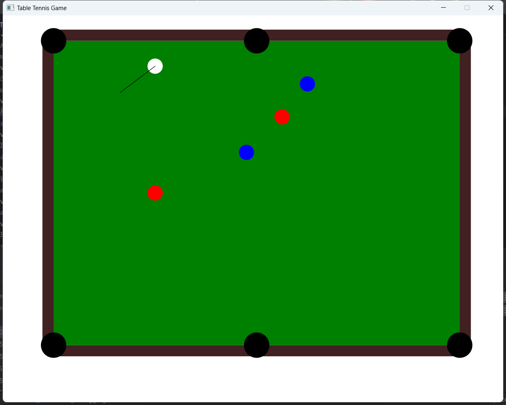

# Design_Pattern_Assignment_1
USTC 高级软件工程 设计模式作业一

经典的台球游戏

## 概述
实现⼀个桌球游戏。桌上有6个球袋，球可以落⼊其中并计分。游戏开始时，所有球放在桌上的某个位置，其中有⼀个⽩球，玩家只能击打⽩球，并让⽩球撞击其他颜⾊的球。如果球撞击桌⼦边缘，则反弹。球可以撞击其他球，并传递动量。该游戏为单⼈游戏，胜利条件为除⽩球外的所有球均已⼊袋，失败条件为⽩球⼊袋。

## 要求
1. 使⽤⼯⼚模式读取并处理配置⽂件的各部分
2. 使⽤建造者模式创建球( Ball )
3. 使⽤策略模式控制球落⼊袋之后的⾏为
4. 球桌( Table )的尺⼨，颜⾊和摩擦⼒可配置
5. 球的颜⾊，初始位置/速度，质量可配置
6. 实现球在碰撞其他球和桌⾯边缘的物理效果（动量变化）
7. 实现球在桌⾯上由于摩擦⼒⽽减速
8. 实现胜利和失败条件
9. 击球控制：可以使⽤⿏标控制击打⽩球，点击⽩球并拖拽以控制⽅向和⼒度，释放⿏标以击球。只有在⽩球静⽌时可以击球。击球控制需有相应的图形指⽰。
10. 当前仅考虑红球和蓝球，红球⼊袋后即消失，蓝球第⼀次⼊袋后回到初始位置，第⼆次⼊袋后消失

## 环境
- java: 17.0.2
- javafx: 0.0.13

## 运行
`gradle run`直接运行

## 结果
效果图：

